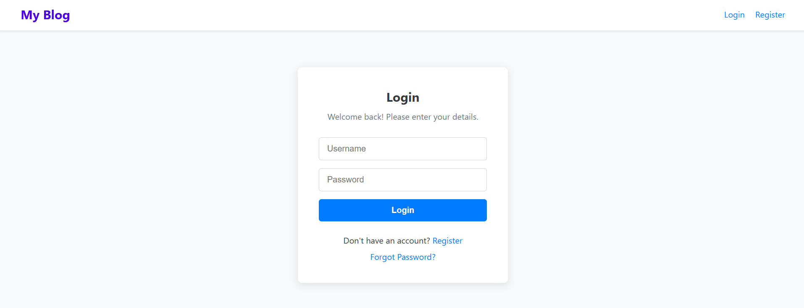
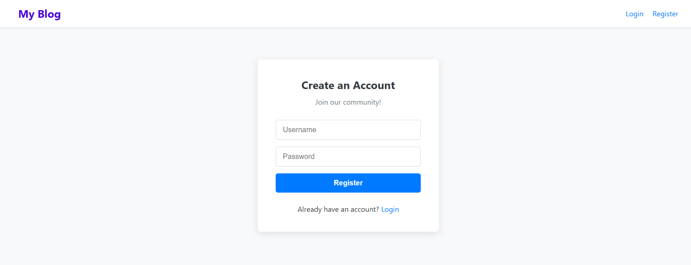
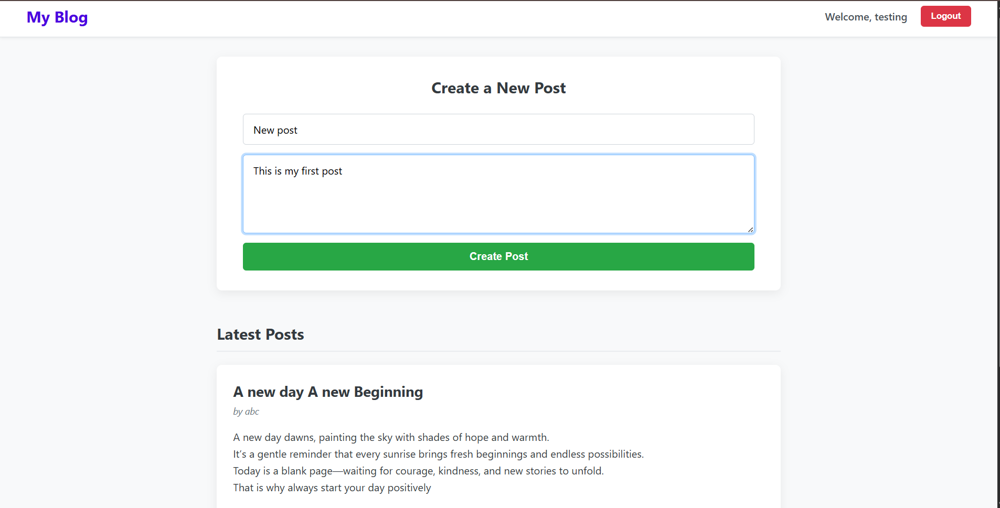
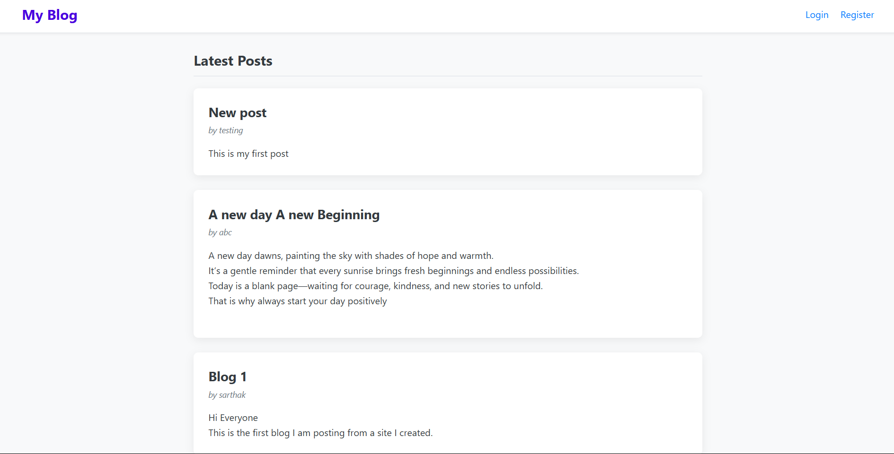
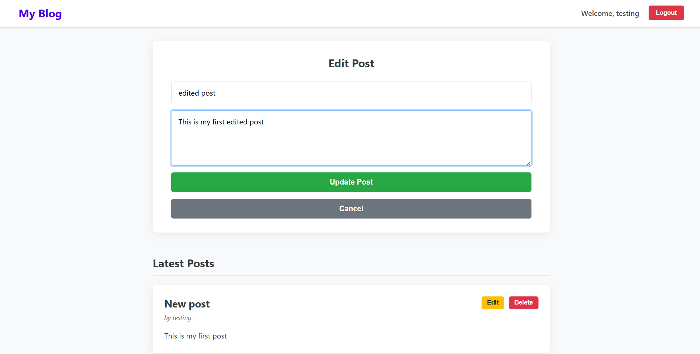

# ✍️ MERN Blog Website

A full-stack blogging platform built with the MERN stack. Users can sign up, sign in, create blogs, edit them, and explore blogs posted by others—all with a clean, responsive UI.

---

## 🌐 Live Links

- 🖥️ **Frontend**: [https://blogwebsitesarthak.netlify.app/](https://blogwebsitesarthak.netlify.app/)
- ⚙️ **Backend**: [https://mern-backend-834q.onrender.com](https://mern-backend-834q.onrender.com)

---

## 📸 Screenshots

> Make sure to place these screenshots inside a `screenshots/` folder in your root directory.

### 🔐 Login Page  


### 🆕 Register Page  


### 📝 Create Blog Page  


### 📃 Blog List View  


### ✏️ Edit Blog Page  


---

## 📁 Project Structure

```
BlogWebsite/
├── backend/              # Express server with MongoDB and JWT Auth
├── frontend/             # React frontend using Context API or Redux
├── screenshots/          # UI screenshots for README
└── README.md             # This file
```

---

## ✨ Features

### ✅ Frontend
- Signup/Login functionality with JWT auth
- Create, update, and delete blogs
- View all blogs by all users
- Responsive design using TailwindCSS
- Markdown-style rich-text blog editing
- Clean blog preview and reading experience

### 🛠️ Backend
- RESTful API using Express.js
- MongoDB for persistent blog and user storage
- JWT-based authentication and protected routes
- Blog CRUD endpoints
- User authentication and authorization middleware

---

## ⚙️ Getting Started (Local Setup)

### 🔹 Clone the repository

```bash
git clone https://github.com/sarthakmehra02/BlogWebsite.git
cd BlogWebsite
```

### 🔹 Install dependencies

```bash
cd frontend && npm install
cd ../backend && npm install
```

### 🔹 Add `.env` to `/backend`:

```
PORT=5000
MONGODB_URI=your_mongo_uri
JWT_SECRET=your_jwt_secret
```

### 🔹 Run the servers

```bash
# In /backend
npm start

# In /frontend
npm run dev
```

---

## 📌 Future Enhancements

- [ ] Blog likes and comments
- [ ] Image upload support
- [ ] Categories/tags filtering
- [ ] Rich-text editor integration
- [ ] Admin panel for blog moderation
- [ ] Dark/light theme toggle

---

## 👨‍💻 Author

**Sarthak Mehra**  
GitHub: [@sarthakmehra02](https://github.com/sarthakmehra02)

---

## 🪪 License

MIT License
